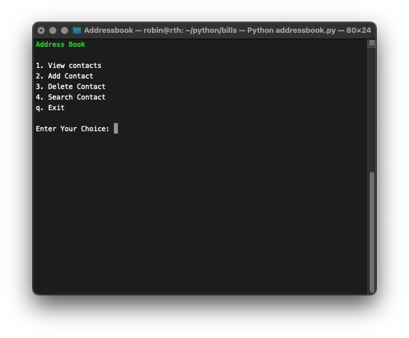

# 📖 Address Book

  
  


**Address Book** is a simple **Python-based command-line application** designed to store, view, and manage contacts efficiently. It uses **JSON** to save contact data and allows users to retrieve information by selecting an indexed list.

## 🖼️ Logo


## 🚀 Features

✔️ **View Contact List** – Displays contacts with their index number.  
✔️ **Search & Select Contact** – View detailed contact information.  
✔️ **Easy Data Storage** – Contacts saved in `addresses.json`.  
✔️ **Cross-Platform Compatibility** – Works on Linux, macOS, and Windows.

## 📦 Installation

1. Clone the repository:
   ```bash
   git clone https://github.com/rth1972/Addressbook.git
   ```
2. Navigate to the project directory:
   ```bash
   cd Addressbook
   ```
3. Install dependencies:
   ```bash
   pip install -r requirements.txt
   ```
4. Run the application:
   ```bash
   python addressbook.py
   ```

## 📌 Usage

- Choose **View Addresses** to display available contacts.
- Enter a number **to select a contact** and view details.
- Exit the program anytime by selecting **Exit**.

## 🛠️ Contributing

Contributions are welcome! If you’d like to enhance the functionality or add features, follow these steps:

1. Fork this repository.
2. Create a new branch:
   ```bash
   git checkout -b feature-branch
   ```
3. Make your changes and commit:
   ```bash
   git commit -m "Added new feature"
   ```
4. Push and submit a pull request!

## 📜 License

This project is **MIT-licensed**. See the [LICENSE](https://github.com/rth1972/Addressbook/blob/main/LICENSE) file for details.

## 🖼️ Screenshot

## 

---
